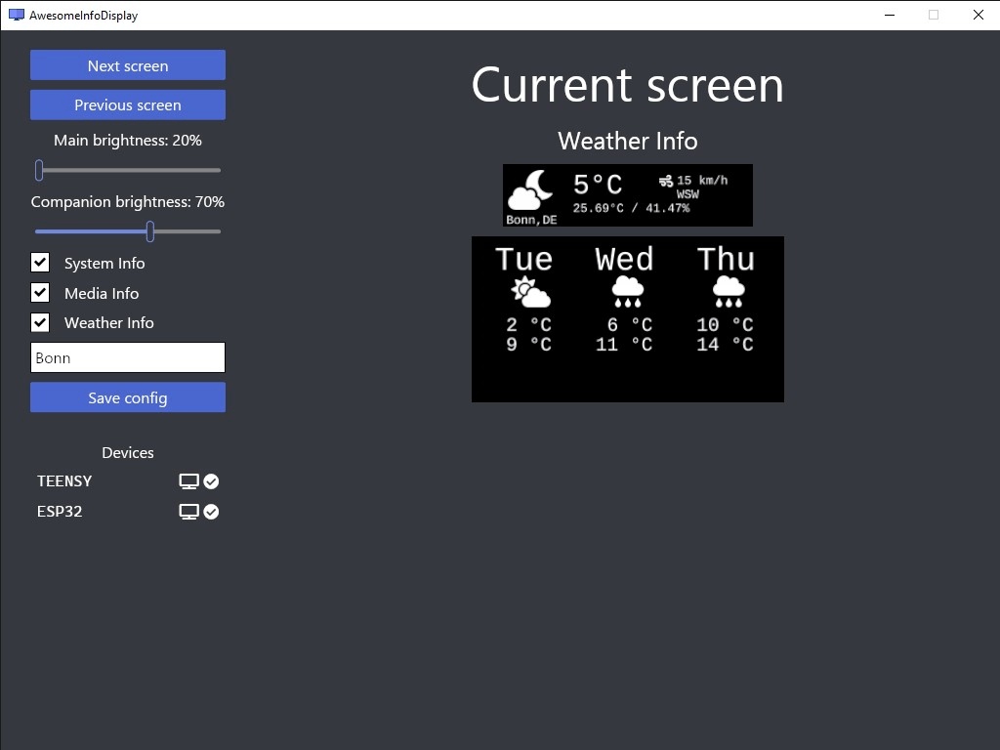

# Awesome Info Display

### Welcome to Awesome Info Display, your open-source solution for creating customizable information displays on external ESP32 devices. With this project, you can easily set up a display to show various screens, such as current memory usage, currently played tracks, or weather information. Whether you're a hobbyist, a tinkerer, or a professional, this project offers flexibility and customization to meet your needs.

## Features

- 🖥️ Display various screens on an external ESP32 display.
- 📈 Supported screens include current memory usage, currently played track, and weather information. 
- 🔌 Plugin support for custom written plugins with a mini api to request config fields, if necessary. 
- 🗔 Works seamlessly on Windows, with plans for Linux and MacOS support in the future. 

## Supported Devices

- https://www.lilygo.cc/products/t-display-s3?variant=42284559827125
- Teensy 4.0 based devices with a 256x64 OLED SSD 1322 (see https://github.com/daniel-prause/teensy-awesome-display)

## Getting Started

To get started with Awesome Info Display, follow these simple steps:

1. Clone the Repository: Clone this repository to your local machine using git clone https://github.com/daniel-prause/awesomeinfodisplay.git.

2. Install Dependencies: Ensure you have all dependencies installed. This should be done automatically via cargo, if you build the project for the first time.

3. Clone the Repository https://github.com/daniel-prause/companion-display. Compile and move the firmware to the ESP32.

4. Connect ESP32 Display: Connect your ESP32 display to your Windows machine.

5. Run the Application: Execute the application on your Windows machine. The display contents of the first available screen will be transferred to the external display, showcasing the currently active screen.

## Contributing

We welcome contributions from the community to help improve Awesome Info Display. Whether you're a developer, a designer, or just an enthusiast, there are many ways you can contribute:

- Report bugs or suggest features by opening an issue on GitHub.
- Submit pull requests to address issues or implement new features.

## License

This project is licensed under the MIT license.

## Acknowledgements

This project utilizes the following third-party components:

- [Font Awesome](https://github.com/FortAwesome/Font-Awesome) - License information available [here](https://github.com/FortAwesome/Font-Awesome/blob/5.x/LICENSE.txt).
- [Liberation Font](https://scripts.sil.org/cms/scripts/page.php?site_id=nrsi&id=ofl) - License information available on the project website.

---

Thank you for choosing Awesome Info Display. Let's build something amazing together! 🚀
